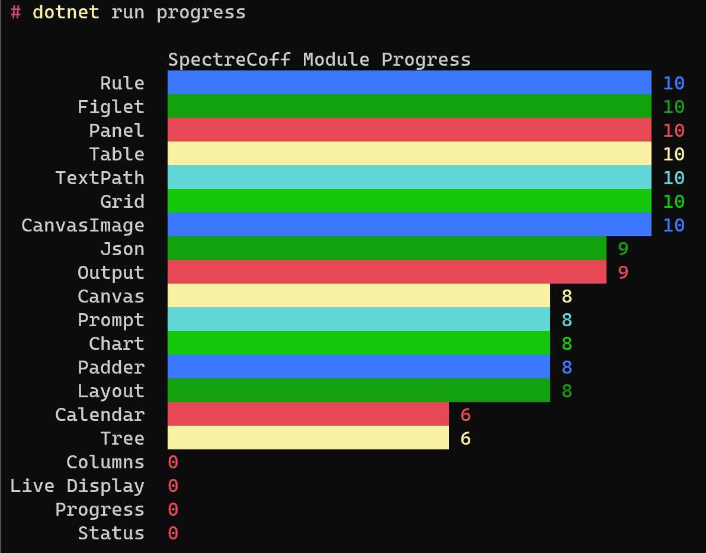

# SpectreCoff
_Spectre Console for F#_ - A thin, opinionated wrapper around [Spectre.Console](https://github.com/spectreconsole/spectre.console).

Available at [Nuget: EluciusFTW.SpectreCoff](https://www.nuget.org/packages/EluciusFTW.SpectreCoff/).

## Table of Contents
- [Goals and Philosophy](#goals-and-philosophy)
- [SpectreCoff Package](#spectrecoff-package)
  * [Output and Markup](#output-and-markup)
  * [Modules](#modules)
  * [Deviations from Spectre.Console](#deviations-from-spectre)
  * [Versioning](#versioning)
- [SpectreCoff Cli](#spectrecoff-cli)
- [Related Work](#related-work)
- [License](#license)
- [Feedback and Contributing](#feedback-and-contributing)

## Goals and Philosophy
Before we get into the details, we'd like to outline our goals and our guiding principles for designing the SpectreCoff api surface.

1. **Make Spectre.Console available for console applications in F# in an idiomatic way.**

    We expose separate functionality in different modules, as functions, with typed arguments instead of generics resp. object-typing. Since many of Spectre's functions can handle multiple different kinds of content that often means wrapping your content in discriminated union type. We believe that the expression of intent as well as the resulting robustness and clarity far outweigh the 'overhead' of wrapping. 

1. **Provide a very simple and consistent api surface.** 

    In SpectreCoff, we follow the structure Spectre.Console provides very closely. 
    - Features of Spectre are translated into modules of the same name. 
    - Whenever possible, each module exposes a function producing '_the module thing_' that is of same name as the module. This will be in form of an `OutputPayload`.
    - The special module `Output` (which also defines the type `OutputPayload`), provides the function `toConsole` with which everything can be printed. 

    In the example of the figlet widget of Spectre, which translates into the figlet module, it looks like this:
    ```fs
    "Hello World"    // figlet content
    |> figlet        // main function of the module producing the figlet instance as a Renderable case of OutputPayload 
    |> toConsole     // toConsole function of the figlet module
    ```
    Of course, for more complex objects, there will be more parameters needed. To achieve this simplicity, the main function uses some defaults (in this example the alignment of the figlet). These defaults can be overwritten 'globally' (as they are just static variables in the module), or passed to other functions taking in more arguments, e.g.,
    ```fs
    "Hello again"
    |> alignedFiglet Left 
    |> toConsole

    // if all your figlets should be left-aligned, you can also set that as the default and use the main figlet function
    defaultAlignment <- Left
    ```
1. **Add a bit of sprinke on top.**

    Spectre is great in providing ways to customize output. We wanted to add a bit on top to make it easier to utilize custom styles consistently throughout applications. Among other things, we decided to include three different semantic levels of output, namely: `calm`, `pumped` and `edgy`, which we also call _convenience styles_. These are supported throughout the modules, and each style can be customized individually.  

1. **Bake the cake and eat it, too.**  

    We want to feel the joy, and pain, of using our api in the fullest. That's why we have included a [cli project](#spectrecoff-cli) in this repository, where we expose the full documentation as well as provide examples for each functionality, using the api itself.
    ```fs
    dotnet run figlet doc            // prints the documentation of the figlet module
    dotnet run figlet example        // shows examples of the module in action
    ```

## SpectreCoff Package
SpectreCoff is organized in modules which mirror the features of Spectre.Console. 
The source code for the nuget package can be found in the subfolder `/src/spectrecoff/`.

### Output and Markup
Spectre offers very flexible markup by using variations of this command ([see here](https://spectreconsole.net/markup)):
```Cs
AnsiConsole.Markup("[red bold]{0}[/]", Markup.Escape("Hello [World]"));
```
There are several ways to achieve the same in SpectreCoff. The most direct translation looks like this:
```Fs
markup (Some Color.Red) (Some Bold) "Hello [World]" |> printMarkedUpInline    
```
However, we recommend using the dedicated `OutputPayload` type, together with the `toConsole` function, which will yield a consistent approach across all kinds of payloads. Using the suitable payload, the example above would look as follows,
```Fs
MarkupCS (Color.Red, Bold, "Hello [World]") |> toConsole
```
#### Payloads
The following table lists all payloads currently available:

| Type         | Alias | Description                                | Parameters                                    | Configurbility |
| ------------ | ----- | ------------------------------------------ | --------------------------------------------- | -------------- |
| MarkupS      | MS    | Content marked up with a style             | style: `SpectreCoff.Layout.Style`<br /> content: `string`                              | -              |
| MarkupC      | MC    | Content marked up with a style             | color: `Spectre.Console.Color`<br /> content: `string`                             | -              |
| MarkupCS     | MCS   | Content marked up with a color and a style | style: `SpectreCoff.Layout.Style`<br /> color: `Spectre.Console.Color`<br /> content: `string` | - |
| Calm     | C     | Convenience style for calm output      | content: `string`                                      | color: `Output.calmColor` <br /> style: `Output.calmStyle` |
| Pumped    | P     | Convenience style pumped output             | content: `string`                                | color: `Output.pumpedColor` <br /> style: `Output.pumpedStyle` |
| Edgy         | E     | Convenience style for edgy output             | content: `string`                             | color: `Output.edgyingColor` <br /> style: `Output.edgyingStyle` |
| Vanilla       | V     | Raw type, no processing will be done       | content: `string`                             | - 
| Link         | -     | Clickable link showing the URL             | content: `string`                             | - 
| LinkWithLabel| -     | Clickable link showing a label             | label: `string` <br /> link: `string`         | - 
| Collection   | CO    | Aggregate multiple payloads in one line    | items: list of `OutputPayload`. <br /> Not allowed: `Renderable`, `BulletItems` | - 
| Emoji        | -     | An emoji, given by it's string literal | emoji: `string` | -
| BulletItems  | BI    | Show list of items with bullet points      | items: list of `OutputPayload`. <br /> Not allowed: `Renderable`, `BulletItems` | bullet item prefix: `Output.bulletItemPrefix`
| Newline      | NL    | An empty line                              | - | -
| Many         | -     | Prints many payloads at once, each on own line | items: list of `OutputPayload` | -
| Renderable   | -     | Wraps a Spectre.Rendering.IRenderable | content: `Spectre.Rendering.IRenderable` | -

#### Convenience Styles
The table above lists three convenience styles: `Calm`, `Pumped` and `Edgy`. With these, we can easily provide a consistent, and semantically meaningful, styling across the modules:
```Fs
Pumped "Hello world" |> toConsole
```
The convenience styles can be altered by mutating the corresponding variables, e.g.,
```Fs
pumpedColor <- Color.Yellow
pumpedStyle <- Style.Italic
```

#### Composition of Payloads
Some of the payloads listed above in turn accept payloads as arguments. Composing them in this way allows printing more complex content, as well as aggregating all output in one go before printing it. This can be seen in this example,
```Fs
Many [
    MarkupC (Color.Green, "Hello friends,")
    Newline    
    Pumped "Welcome to my party tomorrow night!"
    NL                                                // short for Newline
    C "Please bring ... "                             // short for Calm
    BI [                                              // short for BulletItems
        C "some snacks,"        
        P "some games,"                               // short for Pumped
        E "and some creepy stories!"                  // short for Edgy
    ]
    NL
    CO [C "See you "; P "later ... "]                 // short for Collection
] |> toConsole
``` 
In fact, _any other payload_ can be composed using `Many` (including others of type `Many`, they will be flattened) and will be printed once `toConsole` is called.

These composites are also the motivation for the short aliases of payloads, as these make it possible to focuis on the content and not be distracted too much by the types.
For more examples, please see the [sample command](https://github.com/EluciusFTW/SpectreCoff/blob/main/src/spectrecoff-cli/commands/Output.fs).

### Modules
This bar chart (created by SpectreCoff, of course - you can generate it with the command `progress`) breaks down our progress porting the Spectre.Console modules.
Much is already usable, but there is still a way to go. 

<div align="center">
    
</div>

### Deviations from Spectre
The Spectre widget _Rows_ does not have it's own module as the `Many` case of `OutputPayload` covers the same functionality. 

### Versioning
We are using [NerdBank.GitVersioning](https://github.com/dotnet/Nerdbank.GitVersioning) and follow the version scheme: `<major>.<minor>.<git-depth>` for out releases. 

Since this package is a wrapper around _Spectre.Console_, we will synchronize our major and minor versions with the ones of the Spectre dependency we are wrapping.

> <b>Note</b>: In particular, the _third number_ in the version does not have the same meaning as the patches in SemVer. Increments in that number may contain breaking changes, in contrast to patch versions in SemVer.

## SpectreCoff Cli
You can see each module in action by using the cli included in this repository in `/src/spectrecoff-cli/`. 
Simply run
```PS
dotnet run <command> example | doc
```
for any command with the subcommand `example` or `doc`, depending on if you want to see an example, or the documentation of the command.
The currently supported commands are:

| command   | example | doc | 
|-----------|---------|-----|
| output    | ✅       | ❌   |
| rule      | ✅       | ✅   |
| figlet    | ✅       | ✅   |
| panel     | ✅       | ✅   |
| prompt    | ✅       | ✅   |
| bar       | ✅       | ✅   |
| breakdown | ✅       | ✅   |
| table     | ✅       | ✅   |
| tree      | ✅       | ❌   |
| calendar  | ✅       | ❌   |
| padder    | ✅       | ❌   |
| grid      | ✅       | ✅   |
| textpath  | ✅       | ✅   |
| json      | ✅       | ✅   |

## Related Work
In _SpectreCoff_ we take the approach of providing types and functions wrapping the Spectre.Console api. If you prefer dsls via computation expressions, check out this awesome project (hey, even if you don't, check it out anyway!):
- [fs-spectre](https://github.com/galassie/fs-spectre) - 👻💻 Spectre.Console with F# style.

Also, if you want to create a cli using `Spectre.Console.Cli` (recently the cli part was extracted into a separate package), you can use my starter template:
- [fsharp-spectre-console-template](https://github.com/EluciusFTW/fsharp-spectre-console-template) - A minimal starter template for using Spectre.Console.Cli in fsharp


## License
Copyright © Guy Buss, Daniel Muckelbauer

SpectreCoff is provided as-is under the MIT license.
See the LICENSE.md file included in the repository.

## Feedback and Contributing
All feedback welcome!
All contributions are welcome!
